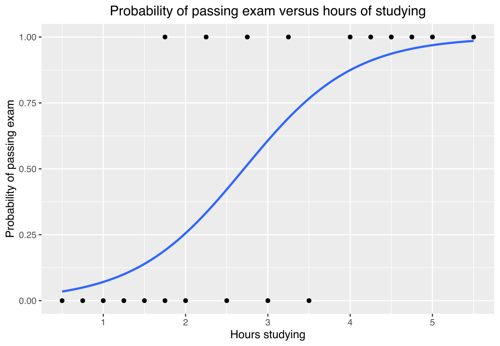

# ML - Logistic Regression

This repo contains a Jupyter Notebbok that present an overview and implement a version of Logistic Rregression, using Numpy.

The notebook is in this <a href='./notebooks/ml_logistic_regression.ipynb'>link</a>.

For run the Jupyter Notebook online, on Binder, click here 

 

  

 
